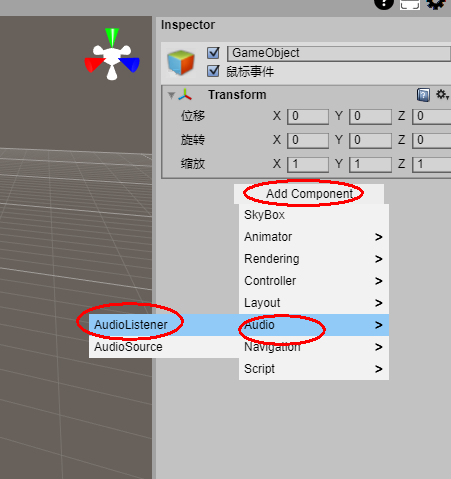
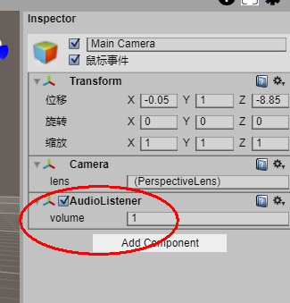
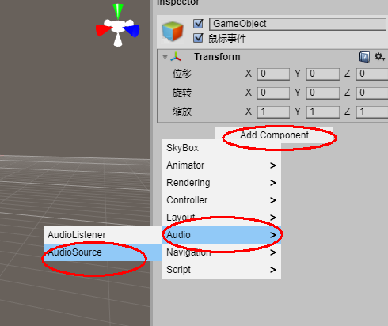
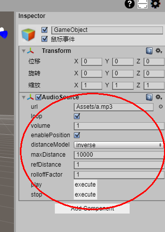

# 声音

音频可以通过音频组件进行播放。

任意被网络浏览器支持所支持的格式同样被feng3d引擎支持。

注：不是所有的格式都被任意浏览器支持。由于被使用最广泛的格式是MP3。

## AudioListener
声音监听器AudioListener相当于耳朵，只有添加了该组件才能够听到声音。默认在 Main Camera 中添加了一个AudioListener组件，或者你也可以把AudioListener添加到你希望接受声音的任意游戏对象上。

 
 

## AudioSource
声源组件AudioSource控制声音的产生，其中可以指定需要播放的音频文件，以及是否启动位置影响声音等。只需要把添加到将会发出声音的游戏对象上即可。

 
 