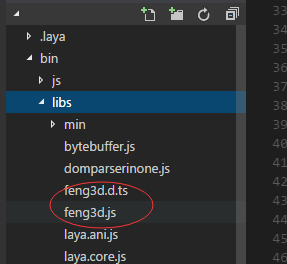
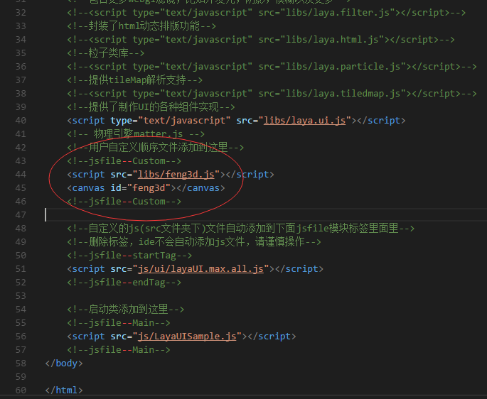
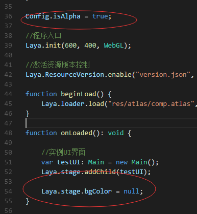

# layabox

feng3d可以很轻松与layabox一起开发。

## 配置环境
1. 拷贝feng3d.d.ts与feng3d.js到bin/libs中

    

1. 在bin/index.html中添加feng3d

    
    ```html
    <script src="libs/feng3d.js"></script>
    <canvas id="feng3d"></canvas>
    ```
1. 设置layabox背景透明的为0
    
    

    分别在LayaBox初始化前与添加界面之后添加以下两行代码
    ```typescript
    // LayaBox初始化前
    Config.isAlpha = true;

    Laya.init(600, 400, WebGL);

    // 添加界面之后
    Laya.stage.bgColor = null;
    ```

1. 初始化feng3d
```typescript
// 初始化feng3d
var engine = new feng3d.Engine(<any>document.getElementById("feng3d"));
```
## 运行结果

[quickstart website](_media/layaboxproject/bin/index.html ':include :type=iframe width=100% height=400px')

## 下载项目

[layabox项目](http://feng3d.com/docs/_media/layaboxproject.zip)