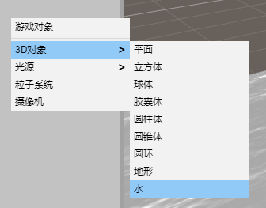
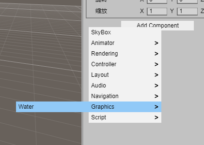
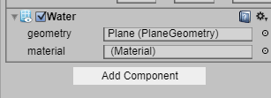
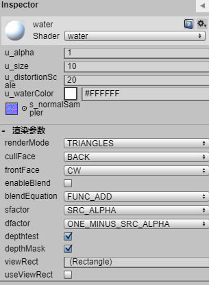
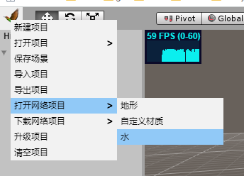

# 水

## 添加水
#### 添加水对象

层级面板右键添加水对象

#### 添加水组件

点击添加水组件

## 属性面板
#### 水组件面板

#### 水材质面板

#### 下载水项目

在点击feng3d图标打开菜单中下载水项目

#### 相关代码

https://github.com/feng3d-labs/feng3d/blob/master/src/water/Water.ts

https://github.com/feng3d-labs/feng3d/blob/master/src/water/WaterMaterial.ts

https://github.com/feng3d-labs/feng3d/blob/master/shaders/water.vertex.glsl

https://github.com/feng3d-labs/feng3d/blob/master/shaders/water.fragment.glsl